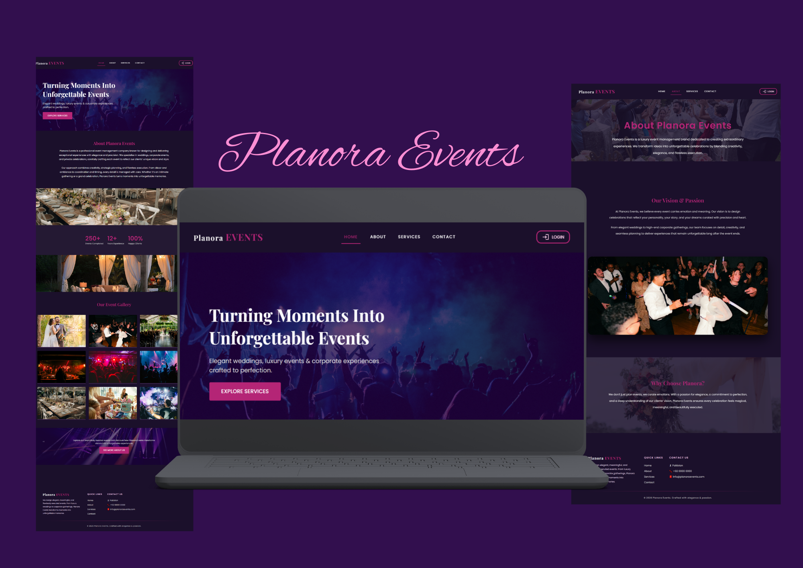

#  Planora Events

Planora Events is a modern and responsive event management website built using React and Material UI.  
The project focuses on clean design, smooth animations, structured components, and an elegant user experience.

It was developed as a frontend project to demonstrate responsive layouts, reusable components, and interactive UI elements.

---

## ✨ Features

- Engaging and visually appealing Hero Section  
- Well-structured About Page  
- Professional Services Section  
- Animated Gallery Section  
- Login & Signup Modal  
- Form Validation (required fields, proper input handling, and error messages)  
- Smooth page transitions  
- Scroll to Top functionality  
- Fully Responsive Design  
- Clean and modern UI/UX  

---
## How to run
npm run dev

---

## Full stack Developer
### Ramsha Ayub
Passionate about building clean, responsive, and user-friendly websites.

